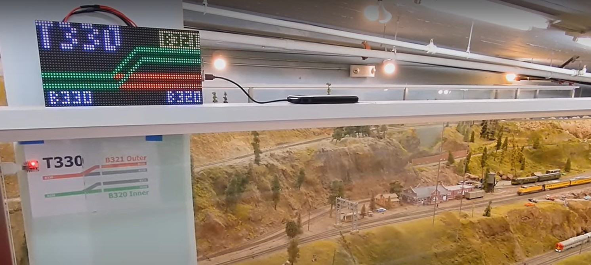

# Distant Signal

**Distant Signal** is a CircuitPython script for an ESP32 to displays the state of a remote
model-railroad turnout on a LED Matrix Display.
A small custom language allows one to define the panel display, and then animate it with a simple trigger.
The color and animation script can be loaded from an MQTT broker.

[<p align=center></p>](https://www.alfray.com/trains/blog/train/2025-03-26_distant_signal_matrix_displa_08700264.html)


## Hardware used for this project

- [AdaFruit MatrixPortal CircuitPython ESP32-S3](https://www.adafruit.com/product/5778)
- [AdaFruit 64x32 RGB LED Matrix - 4mm pitch](https://www.adafruit.com/product/2278)
  or equivalent.

The script is fairly customizable. There are many more LED Matrix displays compatible
with the [AdaFruit MatrixPortal](https://learn.adafruit.com/adafruit-matrixportal-s3)
platform that should work.


### ESP32 Setup

Instructions for the [MatrixPortal ESP32-S3](https://learn.adafruit.com/adafruit-matrixportal-s3).
This page has the
[specification, pin out](https://learn.adafruit.com/adafruit-matrixportal-s3/pinouts)
and this page
[explains how to connect the LED Matrix display](https://learn.adafruit.com/adafruit-matrixportal-s3/prep-the-matrixportal).

- I power the Matrix Portal S3 with a 5V 4A USB-C power supply, as recommended.
  However that seems a tad overkill as I have measured the display to consume
  only between 1A and 2A. Note that these displays only update 1 or 2 rows of pixels at a time
  and power usage only depends on the current lines being updated, not the entire display.

- The device should already come with a USB bootloader and create a USB drive visible
  under Windows or Linux.
  If needed follow the
  [instructions to reflash the bootloader](https://learn.adafruit.com/adafruit-matrixportal-s3/factory-reset#factory-reset-and-bootloader-repair-3107941).

- Plug the ESP32, click the reset button, and as the onboard LED becomes purple,
  immediately click the reset button again. If you do it right, the onboard LED should
  stay and remain _green_. A drive named `QTPYS2BOOT` should appear on USB.

- Run the `setup/_get_circuitpy_uf2.sh` script and drop the downloaded `uf2` file on the
  USB drive. Once the device reboot, a USB drive named `CIRCUITPY` should appear.

- Uploading the code on the ESP32 is done by _copying_ files to the USB drive named
 `CIRCUITPY`.
  You can drag'n'drop stuff manually. I prefer to automate things using scripts with MSYS,
  Cygwin, or Git Bash.

- Tip: Open `src/_lib_upload.sh` and `src/_upload.sh`.

  Change the line `D="/d /f /cygdrive/f"` at the beginning to add the drive letter needed
  for your USB drive. For example "F:" is "/f" under MSYS, "/cygdrive/f" under Cygwin,
  or "/media/usb" under Linux.

I run these from the Terminal tab in VS Code:

```
cd src
# upload all libraries (once)
./_lib_upload.sh adafruit_logging
./_lib_upload.sh adafruit_connection_manager
./_lib_upload.sh adafruit_ticks
./_lib_upload.sh adafruit_minimqtt
./_lib_upload.sh neopixel
./_lib_upload.sh adafruit_matrixportal
./_lib_upload.sh adafruit_bitmap_font
./_lib_upload.sh adafruit_display_text
./_lib_upload.sh adafruit_haslib

# upload the fonts (once)
cp ../font/tom-thumb.bdf /circuitpydrive/
cp ../font/tom-thumb2.bdf /circuitpydrive/

# upload source code (after each modification)
./_upload.sh
```

Update settings:

- Open `setup\settings.toml`.
- Open `F:\settings.toml` (or whatever is your CIRCUITPY USB Drive)
- Copy the settings to the USB drive file, and modify as needed to set the SSID/password
  for your wifi and your MQTT server information:

```
# Setting these variables will automatically connect board to WiFi on boot
CIRCUITPY_WIFI_SSID="Your WiFi SSID Here"
CIRCUITPY_WIFI_PASSWORD="Your WiFi Password Here"

# MQTT integration.
MQTT_BROKER_IP=""
MQTT_BROKER_PORT=1883
MQTT_USERNAME="username"
MQTT_PASSWORD="password"
MQTT_TOPIC_ROOT="ambiance"

# DistantSignal Configuration for this panel
MQTT_TURNOUT="Your_Panel_MQTT_ID_Here"
```

### Development and Debugging

To monitor the serial out of the
[AdaFruit MatrixPortal S3](https://learn.adafruit.com/adafruit-matrixportal-s3),
configure VS Code Serial Monitor with Text mode, Port USB, Baud rate 115200, Line ending LF.

Note that whilst the ESP32 resets (after pressing the "reset" button),
VS Code disconnects from the USB port and loses valuable debug information.
Thus you can't debug your script if it fails to load this way.
Instead, the easiest way to debug a broken script is to _upload_ it.
Any upload triggers a soft reboot which reloads the Python VM and exposes any  missing imports:

```
cd src
./_upload.sh
```


## MQTT Interaction

These are the topic that `Distant Signal` subscribes to.

#### Update Configuration Script

```
Topic: "distantsignal/%(T)s/script"
Value: JSON stringified.
```

Where T is MQTT_TURNOUT as defined in `setting.toml`.

This defines the main configuration script for the display panel. 
See next section for syntax.


#### Set Turnout State

```
Topic: "turnout/%(T)s/state"
Value: string
```

Where T is MQTT_TURNOUT as defined in `setting.toml`.

This selects one of the names defined in the `states` section of the configuration script.


#### Set Block State

```
Topic: "block/%(B)s/state"
Value: "active" or "inactive"
```

Where B is the one of the names defined in the `blocks` section of the configuration script.

This selects the state of a given block number.
Blocks are hidden until they are set as either actie or inactive.


### Configuration Script Syntax

TBD... In the meantime, check [script_example.json](setup/script_example.jsonscript_exam).


## License

License: MIT

https://opensource.org/license/mit

Copyright 2025 (c) ralfoide at gmail

Permission is hereby granted, free of charge, to any person obtaining a copy of this
software and associated documentation files (the “Software”), to deal in the Software
without restriction, including without limitation the rights to use, copy, modify, merge,
publish, distribute, sublicense, and/or sell copies of the Software, and to permit persons
to whom the Software is furnished to do so, subject to the following conditions:

The above copyright notice and this permission notice shall be included in all copies or
substantial portions of the Software.

THE SOFTWARE IS PROVIDED “AS IS”, WITHOUT WARRANTY OF ANY KIND, EXPRESS OR IMPLIED,
INCLUDING BUT NOT LIMITED TO THE WARRANTIES OF MERCHANTABILITY, FITNESS FOR A PARTICULAR
PURPOSE AND NONINFRINGEMENT. IN NO EVENT SHALL THE AUTHORS OR COPYRIGHT HOLDERS BE LIABLE
FOR ANY CLAIM, DAMAGES OR OTHER LIABILITY, WHETHER IN AN ACTION OF CONTRACT, TORT OR
OTHERWISE, ARISING FROM, OUT OF OR IN CONNECTION WITH THE SOFTWARE OR THE USE OR OTHER
DEALINGS IN THE SOFTWARE.

~~
